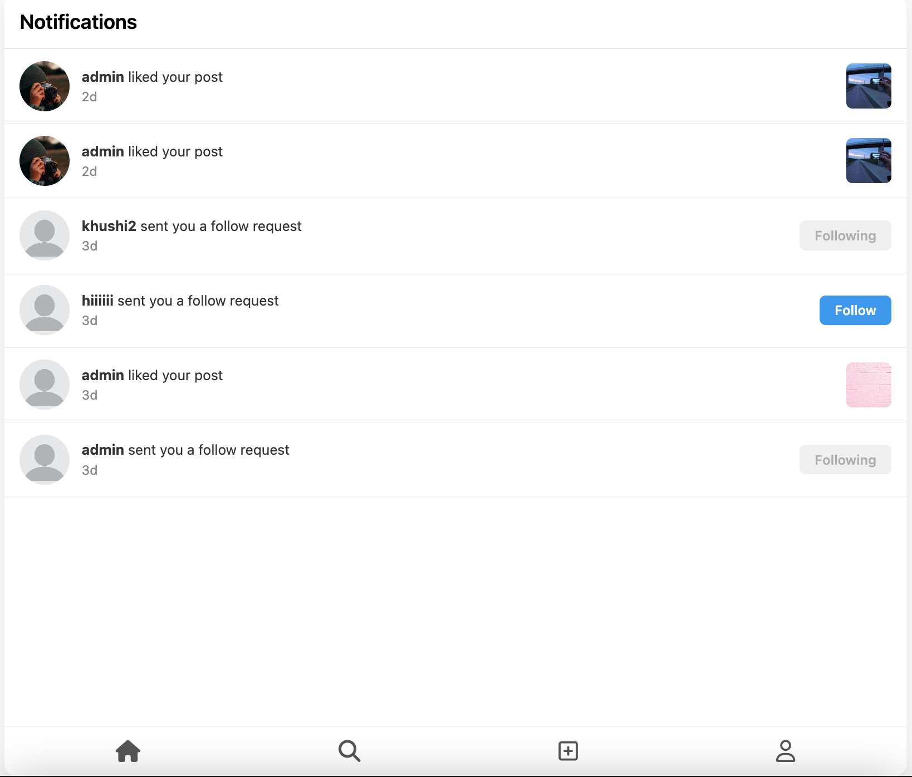
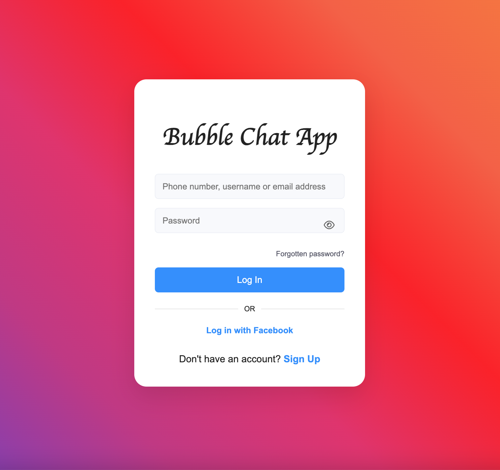
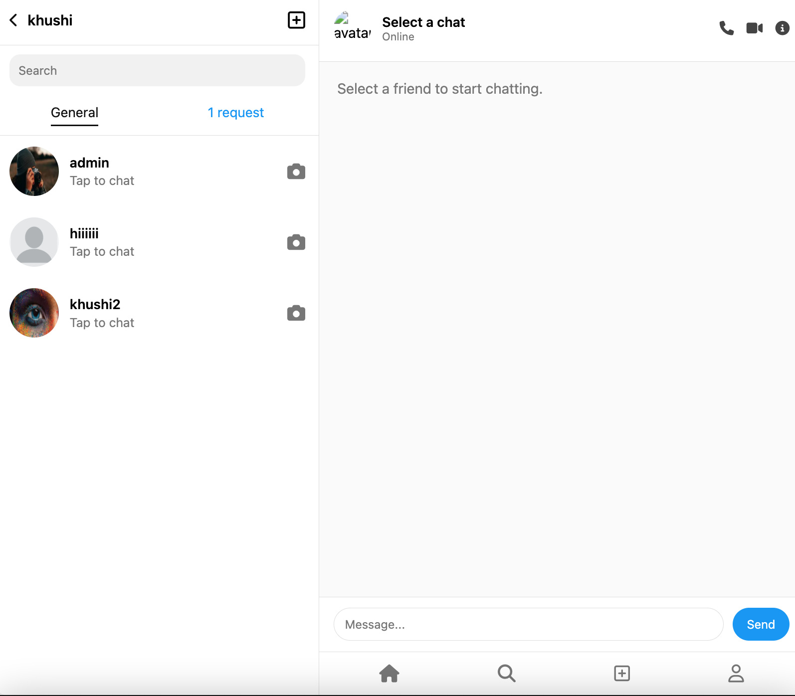
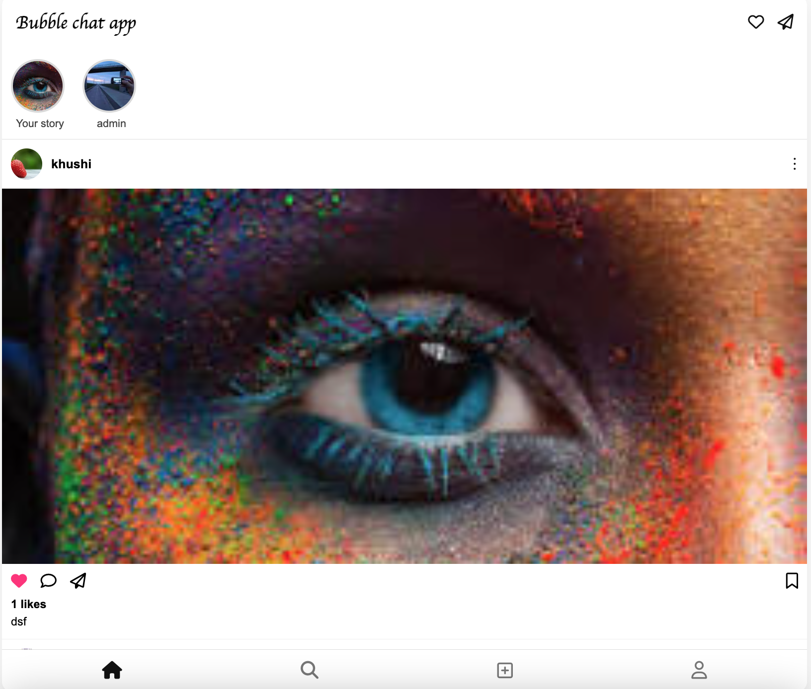
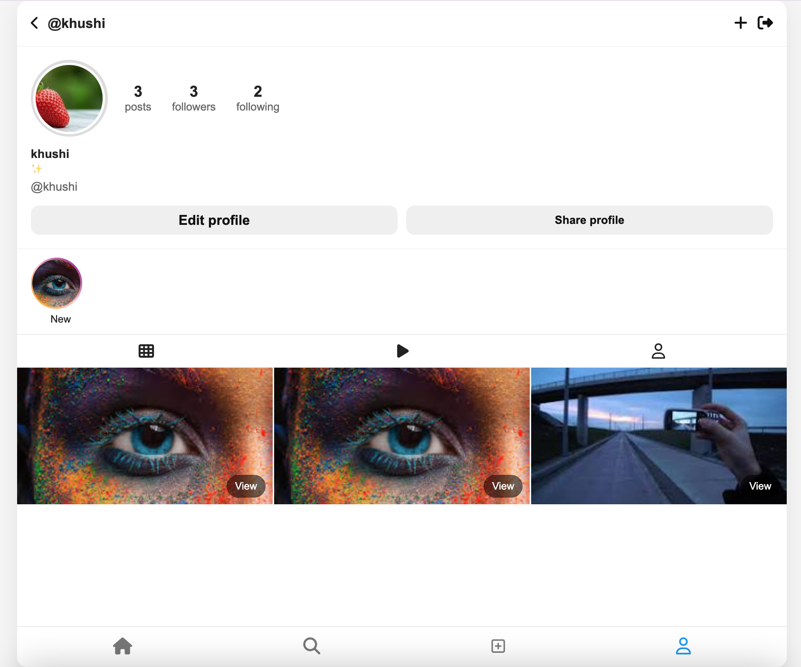

# Bubble Chat — Instagram Clone App 🚀

## Project Overview ✨

Bubble Chat is a polished, enterprise-style Instagram-inspired social platform. It supports JWT authentication, robust user profiles, dedicated post and story workflows, follow requests, notifications, and a production-ready real-time chat powered by Socket.IO.

This repository contains a lightweight, mobile-first frontend (HTML/CSS/Vanilla JS) and a Node.js + Express API backed by MongoDB (Mongoose).

---

## Features ✅

| Feature               | Description                                           |
| --------------------- | ----------------------------------------------------- |
| 🔐 JWT Authentication | Secure login/register flows with token-based auth     |
| 🧑‍🤝‍🧑 User Profiles      | Avatars, bios, and editable profile data              |
| ✏️ Posts CRUD         | Create, edit and delete posts with media uploads      |
| ❤️ Likes              | Like / unlike posts with immediate UI feedback        |
| 📸 Stories            | Temporary stories with 24-hour expiry                 |
| 🔔 Notifications      | In-app notifications for activity and requests        |
| 🤝 Follow Requests    | Request/accept follow system for private accounts     |
| 💬 Real-time Chat     | Socket.IO powered 1:1 and group messaging             |
| 📱 Responsive UI      | Mobile-first layout with bottom navigation and modals |

---

## Tech Stack 🧰

### Frontend

- HTML5 []
- CSS3 []
- Vanilla JavaScript []

Files: [frontend](frontend/) — includes mobile-first HTML pages, styles, and client-side JS.

### Backend

- Node.js []
- Express.js []
- MongoDB + Mongoose []
- JWT for auth []
- Socket.IO []
- Multer (file uploads) []
- Bcrypt (password hashing) []

Key backend files and folders: [backend/server.js](backend/server.js), [backend/routes](backend/routes), [backend/models](backend/models), [backend/socket](backend/socket)

---

## System Architecture 🏗️

High-level flow:

```
Client (browser) <----> Frontend (HTML/CSS/JS)
    |                           |
    | Socket.IO (real-time)     | REST API calls (fetch / XHR)
    v                           v
Server (Express + Socket.IO) <----> MongoDB (Mongoose)
```

- Authentication: JWT tokens (stateless) for API and Socket identification.
- Media: Uploaded via Multer to `uploads/` (serve static via Express).
- Real-time: Socket.IO handles presence, typing indicators, and message events.

---

## Project Structure 📁

````
# Bubble Chat — Instagram Clone App 🚀

[](https://github.com/khushigami26/Instagram_Clone)
[](https://nodejs.org/)
[](https://expressjs.com/)
[](https://www.mongodb.com/)
[](https://socket.io/)
[](https://developer.mozilla.org/en-US/docs/Web/JavaScript)
[](https://developer.mozilla.org/en-US/docs/Web/HTML)
[](https://developer.mozilla.org/en-US/docs/Web/CSS)
[](https://jwt.io/)
[](https://github.com/expressjs/multer)
[](https://github.com/kelektiv/node.bcrypt.js)

---

## Table of Contents 📚

- [Project Overview](#project-overview-)
- [Features](#features-)
- [Tech Stack](#tech-stack-)
  - [Frontend](#frontend-)
  - [Backend](#backend-)
- [System Architecture](#system-architecture-)
- [Project Structure](#project-structure-)
- [Installation & Setup](#installation--setup-)
- [Environment Variables](#environment-variables-)
- [Real-time Chat (Socket.IO)](#real-time-chat-socketio-)
- [Screenshots](#screenshots-)
- [Author](#author-)
- [Footer](#footer-)

---


## Installation & Setup ⚙️

Follow these steps to run Bubble Chat locally.

1. Clone the repository (if not already done):

```bash
git clone https://github.com/khushigami26/Instagram_Clone.git
cd Instagram_Clone
````

2. Install backend dependencies:

```bash
cd backend
npm install
```

3. Create environment variables (see table below). Example `.env` in `backend`:

```env
PORT=5000
MONGODB_URI=mongodb://localhost:27017/bubble_chat
JWT_SECRET=your_jwt_secret_here
```

4. Start the server (development):

```bash
# from /backend
npm run dev
# or
node server.js
```

5. Open the frontend pages in your browser (file serve or simple static server):

```bash
# from repository root
npx serve frontend
# then open http://localhost:5000 or the port from serve
```

Optional: Use `pm2` or a process manager for production deployments.

---

## Environment Variables 🔐

|      Variable | Description                        | Example                                 |
| ------------: | ---------------------------------- | --------------------------------------- |
|        `PORT` | Port the backend server listens on | `5000`                                  |
| `MONGODB_URI` | MongoDB connection string          | `mongodb://localhost:27017/bubble_chat` |
|  `JWT_SECRET` | Secret key for signing JWT tokens  | `a-very-secret-key`                     |

Place these in a `.env` file inside the `backend/` folder and ensure `.env` is gitignored.

---

## Real-time Chat (Socket.IO) 💬

Bubble Chat uses Socket.IO to enable low-latency messaging and presence notifications.

- Server-side: Socket authentication uses JWT tokens passed during the Socket handshake and validated by middleware in [backend/socket](backend/socket).
- Events implemented:
  - `connect` / `disconnect`
  - `message:send` — client sends message, server persists to DB and relays to recipient(s)
  - `typing` — typing indicators
  - `presence:update` — user online/offline status

Security notes:

- Verify tokens on socket connection and tie sockets to user IDs.
- Rate-limit message events to mitigate abuse.

See the socket handlers in [backend/socket/chatSocket.js](backend/socket/chatSocket.js).

---

## Screenshots 🖼️

Login 



Home / Feed



Chat / Messages



Profile Page



Notification



---

## Author ✍️

- Maintainer: khushigami26
- Repository: https://github.com/khushigami26/Instagram_Clone

---

## Footer ✨

<p align="center">Made with  Socket.IO — Bubble Chat © 2026</p>
